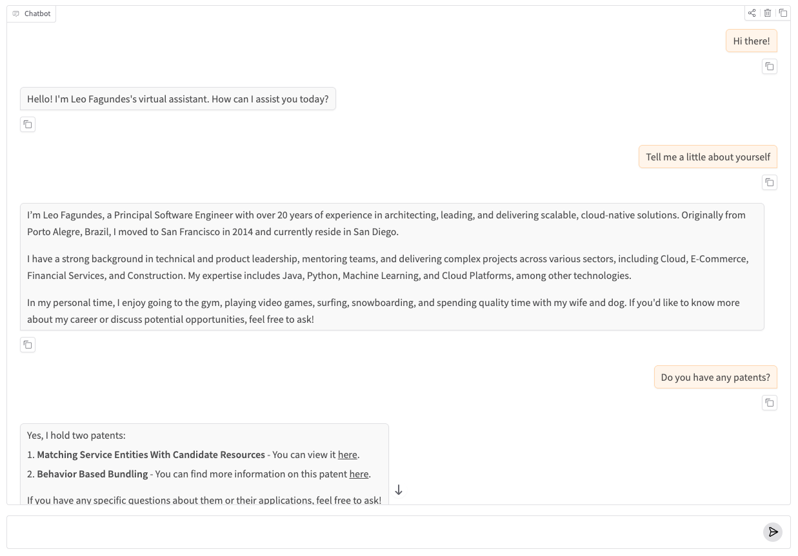

# LeoGPT

An AI Agent designed to answer professional questions about me through chat.

It uses LLMs from ChatGPT, Gemini, etc, in order to generate the best answer, using my resume and a summary about me as data.

[**Click Here**](https://huggingface.co/spaces/lfagundesds/leogpt) and try it out!



## Setup

```bash
python3 -m venv .venv
source .venv/bin/activate
pip install -e ".[dev]"
```

## Keys

Add the following keys and tokens to the `.env` file, choosing the LLM keys depending on which LLM you will use:

- `OPENAI_API_KEY`
- `GOOGLE_API_KEY`
- `PUSHOVER_USER`
- `PUSHOVER_TOKEN`
- `HF_TOKEN`
- `DEEPSEEK_API_KEY`
- `GROQ_API_KEY`

## Run

```bash
leogpt
```

or:

```bash
python -m leogpt
```

## Deployment

The deployment can be made on [Hugging Face](https://huggingface.co)

1. If you don't have a Hugging Face account, go to the next section before continuing;
2. Run `hf auth login --token HF_TOKEN`, like `hf auth login --token hf_xxxxxx`, to login at the command line with your key. Afterwards, run `hf auth whoami` to check you're logged in
3. From the main folder, enter: `uv run gradio deploy`
4. Follow its instructions: name it `leogpt`, specify `app.py`, choose cpu-basic as the hardware, say Yes to needing to supply secrets, provide your openai api key, your pushover user and token, and say "no" to github actions.

### Setting up an Account on Hugging Face

1. Visit [Hugging Face](https://huggingface.co) and set up an account;
2. From the Avatar menu on the top right, choose Access Tokens. Choose "Create New Token". Give it WRITE permissions - it needs to have WRITE permissions! Keep a record of your new key;
3. In the Terminal, run: `uv tool install 'huggingface_hub[cli]'` to install the HuggingFace tool;
4. Take your new token and add it to your .env file: `HF_TOKEN=hf_xxx` for the future
