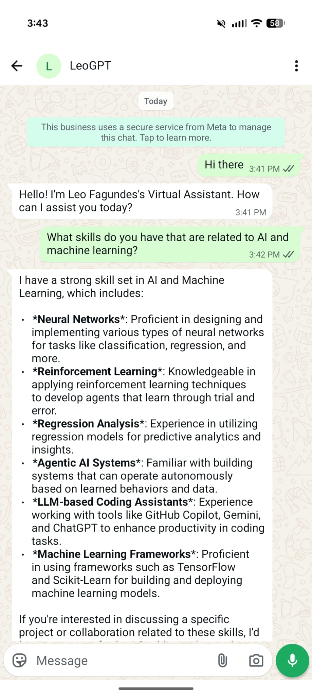
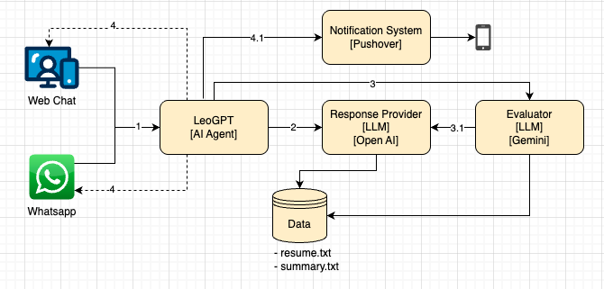

# LeoGPT

Multi-LLM Conversational AI Agent that answers professional questions about me via Web Chat and WhatsApp.

It orchestrates multiple LLMs (Anthropic, OpenAI, Gemini) as response providers, in order to generate the best answer, using my resume and my summary as data.

It also implements an LLM-as-evaluator pattern to validate and retry low-quality responses, and integrates a real-time notification pipeline for unresolved queries and lead capture.

## Web Chat

[**Click Here**](https://huggingface.co/spaces/lfagundesds/leogpt) to try out the Web Chat on Hugging Face Spaces!


## Whatsapp

The Whatsapp version can only be used in test mode unless I create a full Facebook Business Account, but here's a screenshot of how the Agent behaves. The whatsapp version is on [its own branch](https://github.com/lfagundesds/leogpt/tree/whatsapp).

<p align="center">
  
</p>

## Design



**Steps:**

1. User Sends a message through Web Chat or Whatsapp.
2. AI Agent sends a prompt to the Response Provider LLM with the message and data (resume + summary).
3. AI Agent calls the Evaluator LLM to evaluate the response from the Provider.
   1. If the evaluation returns Unacceptable, the Response Provider tries again.
4. The AI Agent shows the response on the Web Chat or Whatassp.
   1. If there was an error, a question that couldn't be answered, or if the user sends their contact info, the Notification System sends me an email.

## Keys

Add the following keys and tokens to the `.env` file, choosing the LLM keys depending on which LLM you will use:

- `ANTHROPIC_API_KEY`
- `GEMINI_API_KEY`
- `OPENAI_API_KEY`
- `EMAIL_ADDRESS`
- `MAILGUN_API_KEY`
- `MAILGUN_SANDBOX`

## Local Setup

```bash
python3 -m venv .venv
source .venv/bin/activate
pip install -e ".[dev]"
```

## Run

```bash
leogpt
```

or:

```bash
python -m leogpt
```

## Deployment

The deployment can be made on [Hugging Face](https://huggingface.co)

1. If you don't have a Hugging Face account, go to the next section before continuing;
2. Run `hf auth login --token HF_TOKEN`, like `hf auth login --token hf_xxxxxx`, to login at the command line with your key. Afterwards, run `hf auth whoami` to check you're logged in
3. Run `uv pip compile pyproject.toml -o requirements.txt` to update the requirements.
4. From the main folder, enter: `gradio deploy`
5. Follow its instructions: name it `leogpt`, specify `app.py`, choose cpu-basic as the hardware, say Yes to needing to supply secrets, provide your openai api key, your pushover user and token, and say "no" to github actions.

### Setting up an Account on Hugging Face

1. Visit [Hugging Face](https://huggingface.co) and set up an account;
2. From the Avatar menu on the top right, choose Access Tokens. Choose "Create New Token". Give it WRITE permissions - it needs to have WRITE permissions! Keep a record of your new key;
3. In the Terminal, run: `uv tool install 'huggingface_hub[cli]'` to install the HuggingFace tool;
4. Take your new token and add it to your .env file: `HF_TOKEN=hf_xxx` for the future
